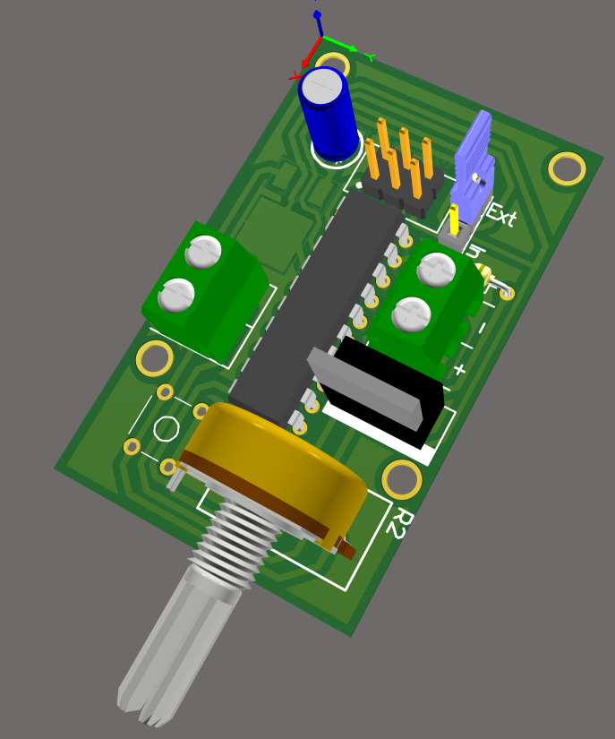
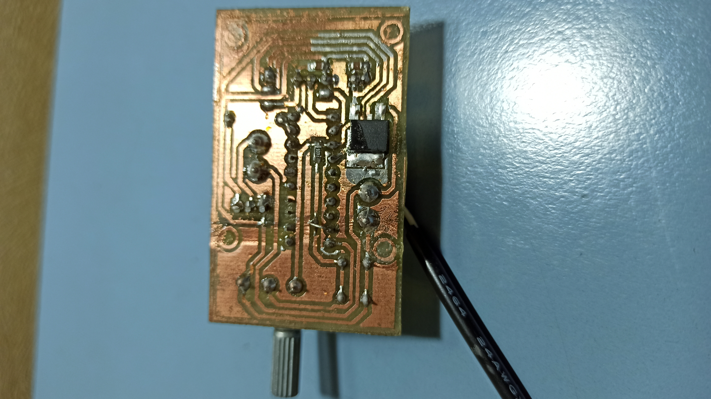
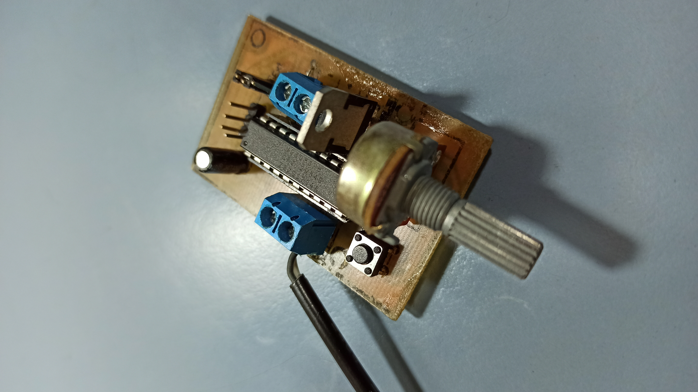

# Ligth-Desktop

_El objetivo era iluminar mi escritorio ya que la la posición de la luz en el cuarto no era acorde para realizar tareas como estudiar o trabajar._

## Comenzando 🚀

_Se desarrolló una solución de bajo costo tanto en el hardware como el software._

Mira **Deployment** para conocer como desplegar el proyecto.

## Hardware 🛠️

_El diseño fue realizado en [Altium Designer](https://www.altium.com/es)._

## Autor

* **Tobias Bavasso Piizzi**  - [TobiasBp99](https://gist.github.com/TobiasBp99)

---
⌨️ con ❤️ por [TobiasBp99](https://gist.github.com/TobiasBp99) 😊